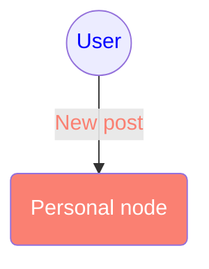

# personal-node
For personal data hosting

## API references
### Host
#### GET `api/host/info`

### User
#### GET `api/user/get`

#### GET `api/user/list`

#### POST `api/user/register`
- Content-Type: `application/json`

#### POST `api/user/update`
- Content-Type: `application/json`

### Upload
#### POST `api/upload/token`
- Content-Type: `multipart/form-data`

#### POST `api/upload/file`
- Content-Type: `multipart/form-data`

#### POST `api/upload/image`
- Content-Type: `multipart/form-data`

#### POST `api/upload/video`
- Content-Type: `multipart/form-data`

#### POST `api/upload/json`
- Content-Type: `application/json`

### Pin
#### POST `api/pin/add`
- Content-Type: `application/json`
