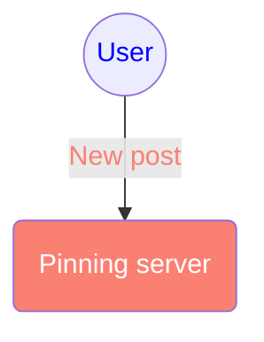

# personal-node
For personal data hosting

## API references
#### POST `api/file/upload`
- Content-Type: `multipart/form-data`

#### POST `api/json/upload`
- Content-Type: `application/json`

#### POST `api/pin/update`
- Content-Type: `application/json`
