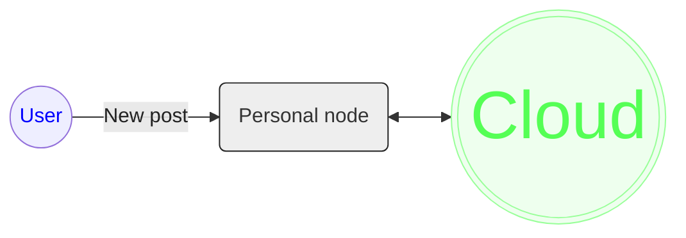

# pp-node
The decentralized personal data hosting node



## API references
<details>
    <summary>api/host</summary>
    
### GET `api/host/info`
- Query:
  - `id`: string, optional. If provided, return host info for particular user id.

- Return: 
```
{
  info: {
    is_register_enabled: false, # true/false,
    is_reclaim_enabled: false,  # true/false,
    peer_id: ""
  }
}
```
</details>
<details>
    <summary>api/user</summary>

### GET `api/user/get`
- Query:
  - `id`: string, optional.
  - `name`: string, optional.
  - One of `id` and `name` must be provided.

- Return: 
```
{
  user: {
    id: <user_id>,
    name: <user_name>,
    public_key: <user_public_key>
  }
}
```

### GET `api/user/list`
- Return:
```
{
  users: []  # Items are users with same format as above
}
```

### POST `api/user/register`
- Content-Type: `application/json`
- Body:
  - `id`:
  - `name`:
  - `public_key`:
  - `signature`:
- Return:
 ```
{
}
```  

### POST `api/user/update`
- Content-Type: `application/json`

</details>
<details>
    <summary>api/upload</summary>

### GET `api/upload/token`
- Return:
```
{
  token: <token>
}
```

### POST `api/upload/file`
- Content-Type: `multipart/form-data`
- Body:
  - `id`: User id, string, required.
  - `token`: Got from `api/upload/token`, string, required.
  - `signature`: Signature of `token`, string, required.
- Return:
```
{
  cid: <cid>
}
```

### POST `api/upload/image`
- Content-Type: `multipart/form-data`
- Body:
  - `id`: User id, string, required.
  - `token`: Got from `api/upload/token`, string, required.
  - `signature`: Signature of `token`, string, required.

### POST `api/upload/video`
- Content-Type: `multipart/form-data`
- Body:
  - `id`: User id, string, required.
  - `token`: Got from `api/upload/token`, string, required.
  - `signature`: Signature of `token`, string, required.

### POST `api/upload/json`
- Content-Type: `application/json`
- Body:
  - `id`: User id, string, required.
  - `data`: Serialized JSON dict, string, required.
  - `signature`: Signature of `data`, string, required.
- Return:
```
{
  cid: <cid>
}
```

</details>
<details>
    <summary>api/pin</summary>

### POST `api/pin/add`
- Content-Type: `application/json`
- Body:
  - `id`: User id, string, required.
  - `data`: Serialized JSON dict, string, required.
  - `signature`: Signature of `data`, string, required.
- Expanded data:
  - `cids`: Array of cid strings, required, min lengh: 1.
- Return:
```
{
}
```

</details>
